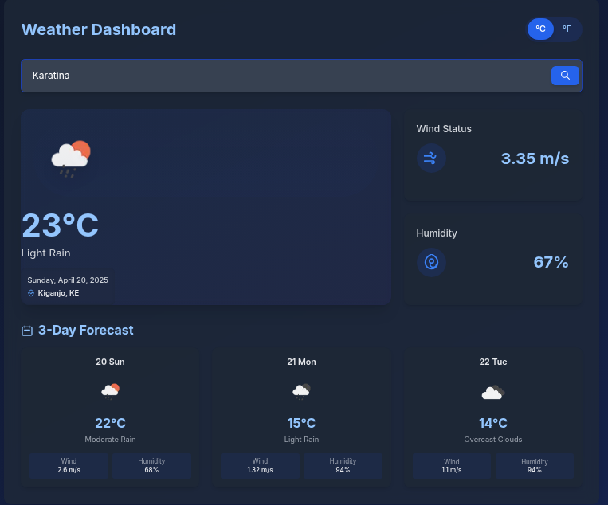

# Weather App

A decoupled weather application built with NextJS (frontend) and Laravel (backend), using the OpenWeatherMap API for weather data.

## Project Structure

This project follows a decoupled architecture:

- **Frontend**: NextJS application with TypeScript and RippleUI components
- **Backend**: Laravel API service that interacts with OpenWeatherMap

## Frontend (NextJS)

### Technologies Used

- NextJS
- TypeScript
- Tailwind CSS with RippleUI components
- Fetch API for AJAX requests

### Features

- City search functionality with OpenWeatherMap Geocoding API
- Toggle between Celsius and Fahrenheit
- Current weather display with icons and descriptions
- Date and location information
- 3-day forecast
- Wind and humidity status information

## Backend (Laravel)

### Technologies Used

- Laravel (latest version)
- HTTP client for API requests
- API-only implementation (no Blade views)

### Features

- OpenWeatherMap API integration
- Geocoding for city search
- Current weather data retrieval
- Multiple day forecast data
- Weather metrics processing (temperature, wind, humidity)


## Development Workflow

1. Make sure both frontend and backend servers are running
2. The frontend will communicate with the backend API, which in turn fetches data from OpenWeatherMap
3. Development changes in either project will be automatically reflected with hot-reloading

## API Flow

```
User Request → Frontend → Backend API → OpenWeatherMap API → Backend → Frontend → User
```

## Notes for Contributors

- Follow the TypeScript guidelines for the frontend
- Ensure proper documentation for all components and API endpoints
- Write tests for critical functionality
- Maintain code style consistency

## License

[MIT License](LICENSE)